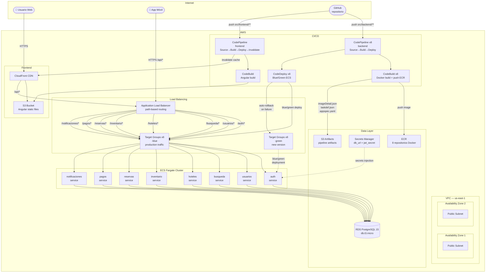

```mermaid
graph TB
    subgraph Internet
        USER([👤 Usuario Web])
        MOBILE([📱 App Móvil])
        GH([GitHub\nrepositorio])
    end

    subgraph AWS
        subgraph CI_CD [CI/CD]
            CP_FE[CodePipeline\nfrontend\nSource→Build→Deploy→Invalidate]
            CP_BE[CodePipeline x8\nbackend\nSource→Build→Deploy]
            CB_FE[CodeBuild\nAngular build]
            CB_BE[CodeBuild x8\nDocker build + push ECR]
            CD[CodeDeploy x8\nBlue/Green ECS]
        end

        subgraph Frontend [Frontend]
            S3[S3 Bucket\nAngular static files]
            CF[CloudFront CDN]
        end

        subgraph LoadBalancing [Load Balancing]
            ALB[Application Load Balancer\npath-based routing]
            TG_BLUE[Target Groups x8\n-blue\nproduction traffic]
            TG_GREEN[Target Groups x8\n-green\nnew version]
        end

        subgraph Network [VPC — us-east-1]
            subgraph AZ1 [Availability Zone 1]
                SUBNET1[Public Subnet]
            end
            subgraph AZ2 [Availability Zone 2]
                SUBNET2[Public Subnet]
            end
        end

        subgraph Compute [ECS Fargate Cluster]
            SVC_AUTH[auth\nservice]
            SVC_USR[usuarios\nservice]
            SVC_BSQ[busqueda\nservice]
            SVC_HOT[hoteles\nservice]
            SVC_INV[inventario\nservice]
            SVC_RES[reservas\nservice]
            SVC_PAG[pagos\nservice]
            SVC_NOT[notificaciones\nservice]
        end

        subgraph Storage [Data Layer]
            RDS[(RDS PostgreSQL 15\ndb.t3.micro)]
            ECR[ECR\n8 repositorios Docker]
            SM[Secrets Manager\ndb_url + jwt_secret]
            S3_ART[S3 Artifacts\npipeline artifacts]
        end
    end

    %% User flows
    USER -->|HTTPS| CF
    MOBILE -->|HTTPS /api/*| ALB

    %% Frontend delivery
    CF --> S3

    %% API flow — CloudFront /api/* behavior → ALB path-based routing
    CF -->|/api/*| ALB
    ALB -->|/auth/*| TG_BLUE
    ALB -->|/usuarios/*| TG_BLUE
    ALB -->|/busqueda/*| TG_BLUE
    ALB -->|/hoteles/*| TG_BLUE
    ALB -->|/inventario/*| TG_BLUE
    ALB -->|/reservas/*| TG_BLUE
    ALB -->|/pagos/*| TG_BLUE
    ALB -->|/notificaciones/*| TG_BLUE

    TG_BLUE --> SVC_AUTH
    TG_BLUE --> SVC_USR
    TG_BLUE --> SVC_BSQ
    TG_BLUE --> SVC_HOT
    TG_BLUE --> SVC_INV
    TG_BLUE --> SVC_RES
    TG_BLUE --> SVC_PAG
    TG_BLUE --> SVC_NOT

    %% Green TGs used during deployments
    TG_GREEN -.->|blue/green\ndeployment| SVC_AUTH

    %% Data
    SVC_AUTH & SVC_USR & SVC_BSQ & SVC_HOT & SVC_INV & SVC_RES & SVC_PAG & SVC_NOT --> RDS
    SM -.->|secrets injection| SVC_AUTH

    %% CI/CD backend
    GH -->|push src/backend/**| CP_BE
    CP_BE --> CB_BE
    CB_BE -->|push image| ECR
    CB_BE -->|imageDetail.json\ntaskdef.json\nappspec.yaml| S3_ART
    CP_BE --> CD
    CD -->|blue/green deploy| TG_BLUE
    CD -->|auto-rollback\non failure| TG_GREEN

    %% CI/CD frontend
    GH -->|push src/frontend/**| CP_FE
    CP_FE --> CB_FE
    CB_FE --> S3
    CP_FE -->|invalidate cache| CF
```
