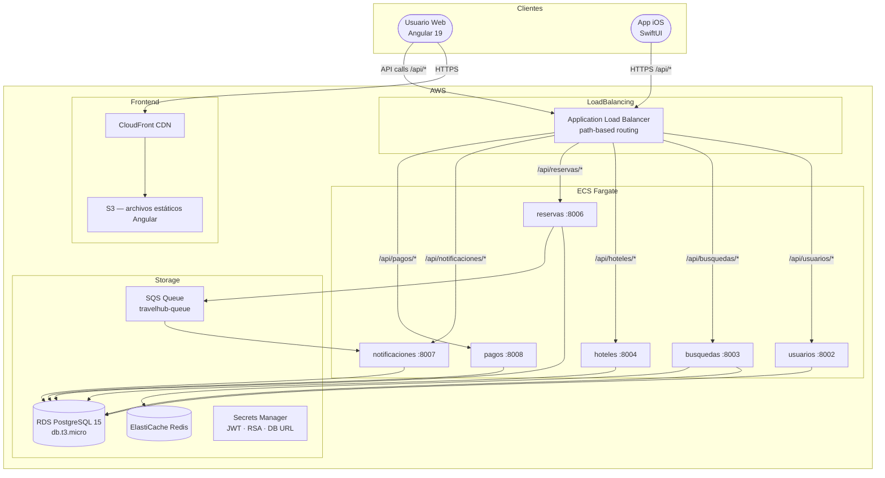

# Arquitectura General — TravelHub

## Diagrama de componentes

## Decisiones de arquitectura

### Microservicios independientes

Cada servicio tiene su propia base de datos lógica (mismo servidor RDS, distinto schema/tablas) y se despliega de forma independiente. Esto permite escalar y desplegar `busquedas` sin tocar `pagos`.

### Routing por path en el ALB

El ALB distingue servicios por prefijo de ruta:

| Ruta | Servicio |
|---|---|
| `/api/usuarios/*` | usuarios |
| `/api/busquedas/*` | busquedas |
| `/api/hoteles/*` | hoteles |
| `/api/reservas/*` | reservas |
| `/api/notificaciones/*` | notificaciones |
| `/api/pagos/*` | pagos |

En desarrollo local, nginx en el puerto `8080` replica este comportamiento.

### Comunicación entre servicios

Aunque el diseño busca desacoplamiento, actualmente sí existen llamadas síncronas entre microservicios:

- `reservas` consulta a `hoteles` vía HTTP (`/hoteles/habitaciones` y `/hoteles/habitaciones/resumen`) para validar y enriquecer la información de habitaciones.

Adicionalmente, la arquitectura contempla comunicación asíncrona vía SQS para eventos de reservas y notificaciones.

### Caché

`busquedas` usa Redis para cachear resultados de búsqueda frecuentes y reducir carga sobre RDS.

## Puertos en desarrollo local

| Servicio | Puerto | Swagger UI |
|---|---|---|
| nginx (gateway) | 8080 | http://localhost:8080/docs |
| usuarios | 8002 | http://localhost:8002/docs |
| busquedas | 8003 | http://localhost:8003/docs |
| hoteles | 8004 | http://localhost:8004/docs |
| reservas | 8006 | http://localhost:8006/docs |
| notificaciones | 8007 | http://localhost:8007/docs |
| pagos | 8008 | http://localhost:8008/docs |

## Stack tecnológico

| Capa | Tecnología | Versión |
|---|---|---|
| Web | Angular | 19 |
| Móvil | SwiftUI | iOS 17+ |
| Backend | FastAPI + Python | 3.12 |
| Base de datos | PostgreSQL | 15 |
| Caché | Redis | 7 |
| Mensajería | AWS SQS | — |
| Cloud | AWS (ECS Fargate, ALB, RDS Aurora, CloudFront) | — |
| IaC | Terraform | — |
| CI/CD | GitHub Actions + AWS CodePipeline/CodeBuild/CodeDeploy | — |
| Contenedores | Docker | — |
