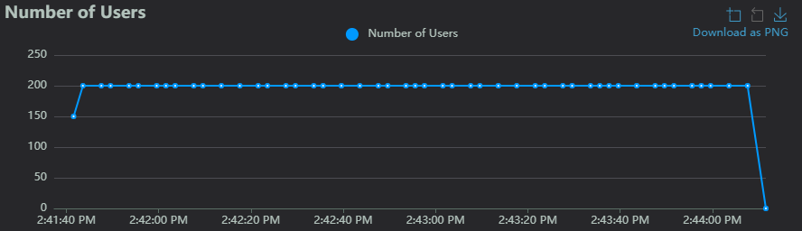
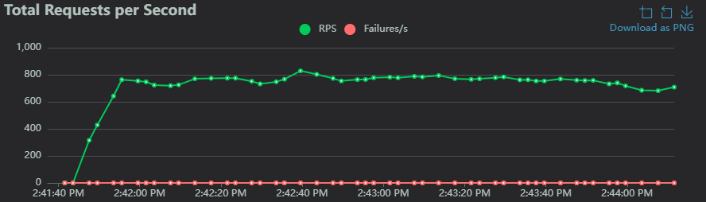
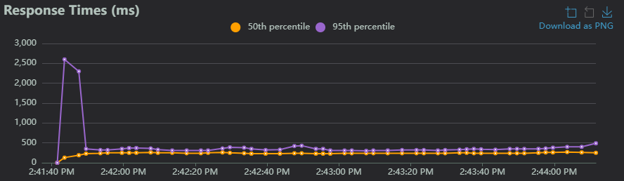

## 6. Conclusiones y Decisión Arquitectónica

* **Fecha de ejecución:** 21 de Febrero de 2026
* **Ejecutado por:** Equipo de Arquitectura
* **Resultado empírico:** Se ejecutó un ataque simulado con 200 usuarios concurrentes sin tiempo de espera, apuntando al endpoint de búsqueda. Como se evidencia en la secuencia gráfica inferior, el sistema experimentó un pico inicial en la latencia ante la inyección abrupta de carga, pero la táctica de *Load Shedding* intervino de inmediato. El sistema comenzó a rechazar el tráfico excedente emitiendo respuestas HTTP 429 instantáneas. Esto permitió que la latencia del percentil 95 (p95) de las peticiones aceptadas se estabilizara por debajo de los 500 ms durante el resto del ataque, protegiendo los recursos de la infraestructura.
* **Decisión:** Se aprueba de manera definitiva la implementación de políticas de *Rate Limiting* estricto (Load Shedding) como mecanismo de defensa primario. Este comportamiento mitiga la saturación del sistema y garantiza que la latencia p95 del *Read-Path* se mantenga dentro del SLA establecido (<= 800ms), dando cumplimiento empírico a los objetivos de resiliencia de la arquitectura.

### Evidencia Gráfica de la Prueba (Locust)

*Figura 1: Rampa de inyección de carga sosteniendo agresivamente 200 usuarios concurrentes.*

*Figura 2: Tasa de peticiones por segundo (RPS) generadas hacia el servidor.*

*Figura 3: Desplome y estabilización de la latencia p95 tras la activación del limitador de tasa, garantizando la supervivencia del servicio y el cumplimiento del NFR.*