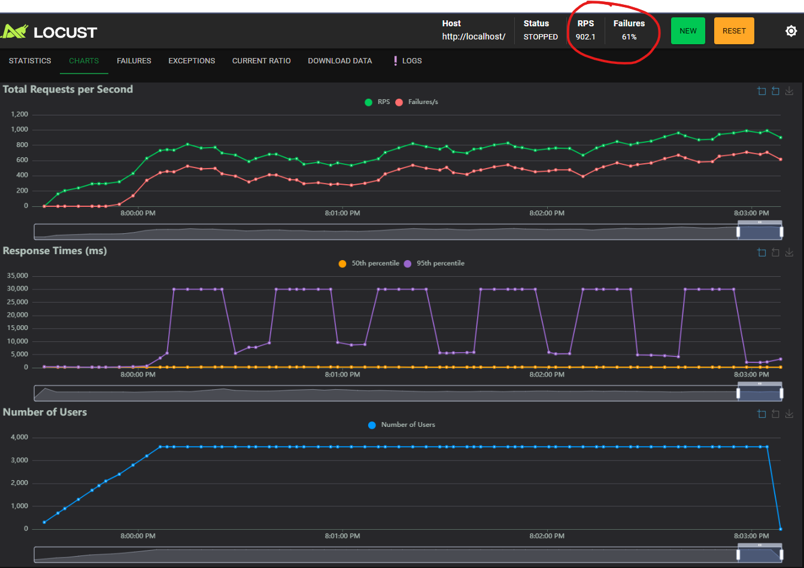

## 2. Resultados y Decisión Arquitectónica

* **Fecha de ejecución:** 26 de Febrero de 2026
* **Ejecutado por:** Equipo de Arquitectura
* **Resultado empírico:** Durante el incremento de carga simulando 3.600 usuarios concurrentes, el sistema alcanzó una tasa sostenida de **902.1 RPS**. En ese momento, se adicionaron dinámicamente nuevos nodos al clúster. Contrario a los resultados esperados (100% de éxito), se registró una **tasa de fallos del 61%**. 
  El riesgo técnico identificado en la hipótesis se materializó: aunque el mecanismo de *Service Discovery* local identificó las nuevas instancias, el balanceador de carga (Nginx) comenzó a enrutar tráfico inmediatamente hacia contenedores cuyo microservicio (FastAPI) aún estaba en proceso de inicialización (*Cold Start*). Esto provocó el rechazo de las conexiones activas y la degradación del servicio, refutando la viabilidad de un balanceo Zero-Downtime sin mecanismos de verificación de estado a nivel de aplicación.
* **Decisión Arquitectónica:** Dado que la estrategia de escalabilidad básica falló en garantizar la continuidad de las transacciones, se determina que la arquitectura de producción en **AWS EKS** no puede depender únicamente del *Service Discovery* a nivel de red. Se establece como **requisito arquitectónico estricto** la implementación de **Readiness Probes** en los manifiestos de Kubernetes. 
  Esta táctica asegurará que el *Ingress Controller* retenga el tráfico hacia las nuevas réplicas instanciadas por el autoescalador hasta que la aplicación reporte explícitamente estar lista (ej. retornando HTTP 200 en un endpoint `/health`), mitigando la pérdida de peticiones y garantizando el cumplimiento de la historia de arquitectura.

### Evidencia Gráfica

*Figura 1: Evidencia de falla del experimento*